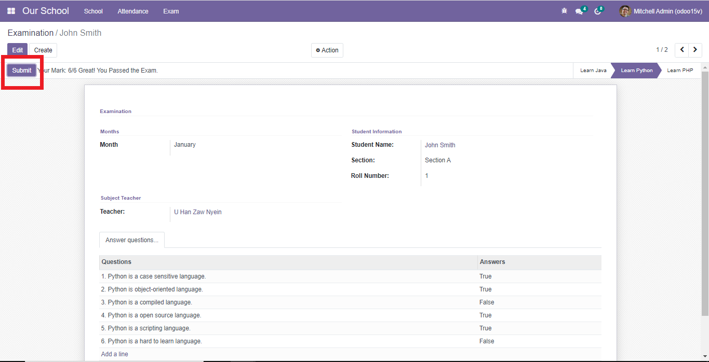

  <h1> School Management System User's Manual</h1>
 
  Group Members: Aung Myat Thu, Ye Zaw Oo
   
  <small> 21, July, 2021</small>
  

## Table of Contents
- [Project Overview](#project-overview)
- [Custom Module Installation](#custom-module-installation)
- [Operation](#operation)
    - [Create Data](#create-data)
    - [Add Data into Sections](#add-data-into-sections)
    - [Create Subjects](#create-subjects)
    - [Create Attendance](#create-attendance)
    - [Create Exam Questions](#create-exam-questions)
    - [Daily Attendance](#daily-attendance)
    - [Monthly Attendance](#monthly-attendance)
    - [Test Exam and Generate Result](#test-exam-and-generate-result)

## Projcet Overview
School management system is very convenient for checking students' roll-call percentage and also useful  for saving attendance records for each student and for testing exams. 
    Functions of the system:
- Manage attendance
- Test Exam

## Custom Module Installation
To run this system you need to install our custom module in odoo version 15. By clicking install button you can easily access this system.

## Operation
### Create Data
For creating new data, go to ***Our School*** main menu and click *create* button

Choose role like teacher or student. If teacher, you can select teacher role like principal, teacher and teacher head. 
Create new student

Create new teacher

Can see data in a group by choosing this options

By clicking these sub menuitems, you can view data in a collection

### Add Data into Sections
Go to School > Sections to create new section and add required data.

After clicking *Save* button, roll-number will be generated automatically.

### Create Subjects
For creating new subject Go to > School > Subjects and fill needed information

### Create Questions
Go to School > Questions menu and write questions and define correct answers.Can hide some questions that do not want to show in exam form view by removing check mark  in the active column .

### Daily Attendance
For creating attendance record Go to > Attendance > Daily Attendance

### Monthly Attendance 
Go to > Attendance > Monthly Attendance to view monthly attendance of each section

### Test Exam and Generate Result
To answer exam questions go to ***Exam*** menu. Choose subject in the status bar. Students whose roll-call precentage is at least 75% can answer exam.

After selecting subject, you can answer questions. And then, click submit button to see your result.

